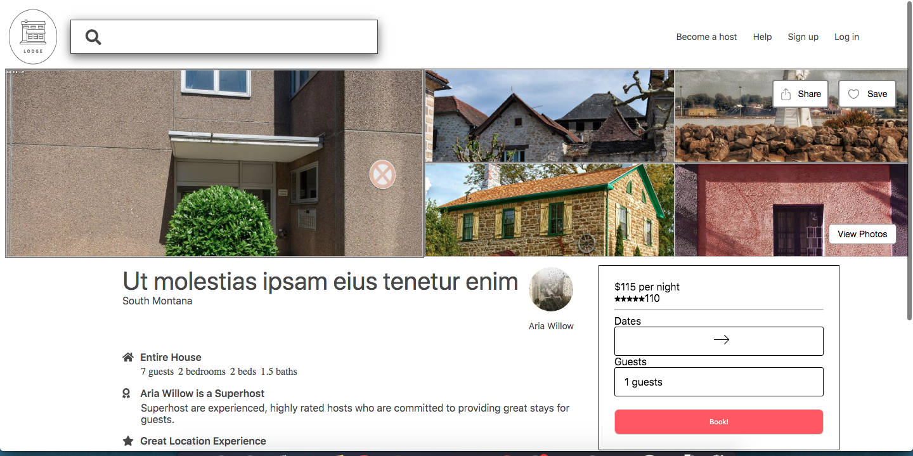

# Description-module

The description-module is a component that allows a homeowner to showcase their home's amenities and great attractions around, but also allows potential guest to have a general view and expectation of their host and lodging.

## Built With

* [React](https://reactjs.org/) - Main framework used
* [Express/Node](https://expressjs.com/) - Used for easy routing
* [MongoDB](https://www.mongodb.com/) - Efficent database seed with a hundred mock data to mimic homes.
* [Docker](https://www.docker.com/) - Easy containering to allow for fast deployment.

### Example when used with other microservices to produce a single listing.

## Related Modules

* [Nav Module](https://github.com/lodge-io/nav-module)
* [Booking Module](https://github.com/lodge-io/booking-module)
* [Review Module](https://github.com/lodge-io/reviews-module)
* [Photo Carousel](https://github.com/lodge-io/image-gallery-module)